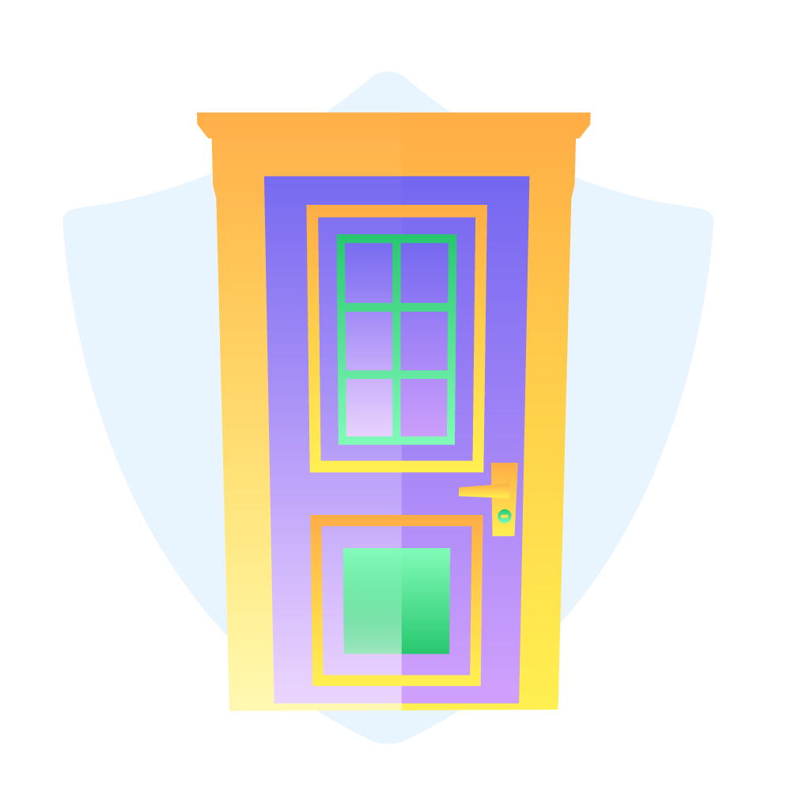

<!--suppress HtmlDeprecatedAttribute -->

# UltimateRifts
**Create your own personal pocket dimension that you can teleport to like an ender chest you can walk into. Customize your rift with upgradeable tiers, unique environments, custom loot and invite friends or lock it down for ultimate privacy.**

[![Discord][Discord shield]][Discord invite]
 
[![Latest version][Latest version shield]][Plugin page]

## Download (Marketplace)
You can visit [our marketplace][Plugin page] to download UltimateRifts as well as take a
look at many other fantastic plugins which are sure to catch your eye.

## Documentation
You can find all the information about UltimateRifts, including dependencies, commands, permissions and incompatible
plugins on [our wiki][Plugin wiki].

Feel free to also contribute to the wiki as a way to help others in the community with using the plugin.

## Support
If you encounter any issues while using the plugin, feel free to contact us on
[our Discord server][Discord invite].

## Suggestions
For suggestions about features you think should be added to the plugin to increase its functionality, feel free to
create a thread over on [our Discord server][Discord invite].

[Plugin page]: https://songoda.com/product/25
[Plugin wiki]: https://wiki.songoda.com/UltimateRifts-1130f108970281d29e49f35c8166a3ad
[Discord invite]: https://discord.gg/7TXM8xr2Ng

[Discord shield]: https://img.shields.io/discord/1214289374506917889?color=5865F2&label=Discord&logo=discord&logoColor=5865F2
[Latest version shield]: https://img.shields.io/badge/dynamic/xml?style=flat&color=blue&logo=github&logoColor=white&label=Latest&url=https%3A%2F%2Fraw.githubusercontent.com%2FSongoda-Plugins%2FUltimateRifts%2Fmaster%2Fpom.xml&query=%2F*%5Blocal-name()%3D'project'%5D%2F*%5Blocal-name()%3D'version'%5D

